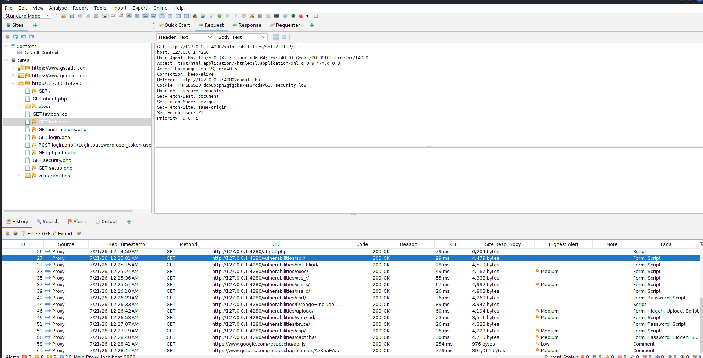
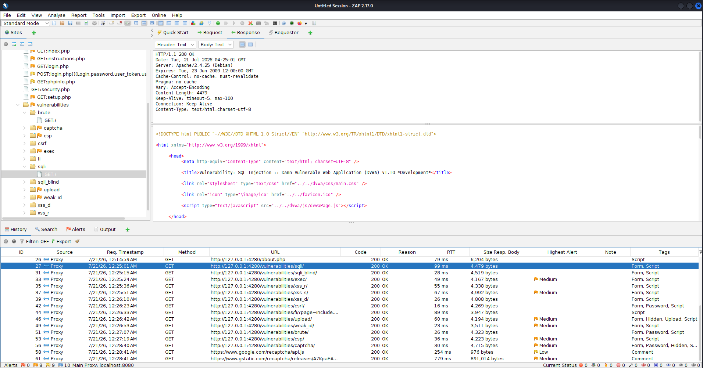
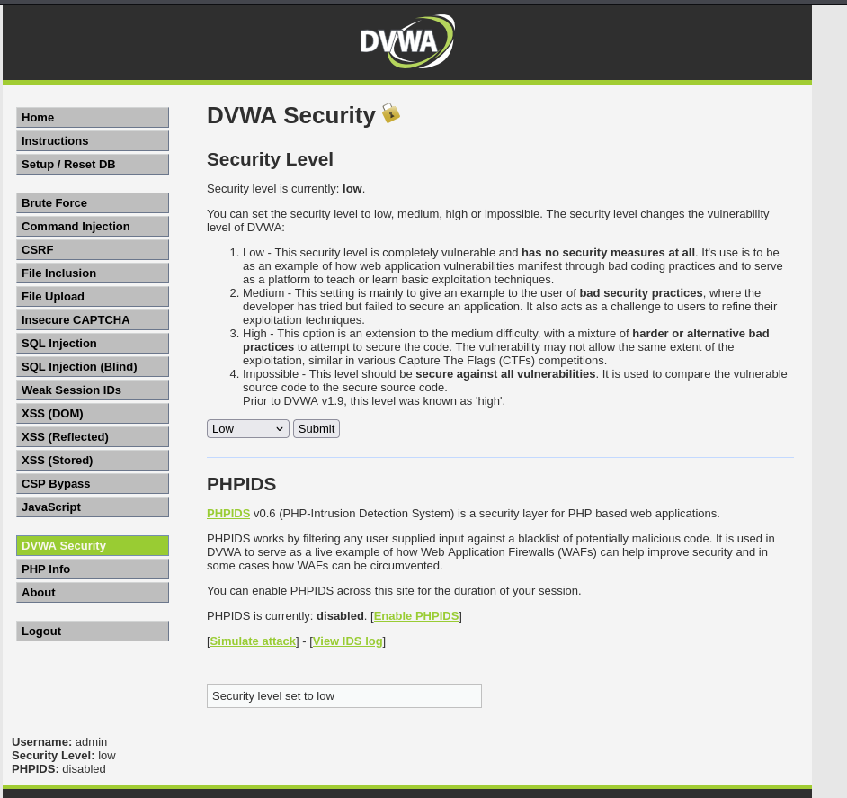
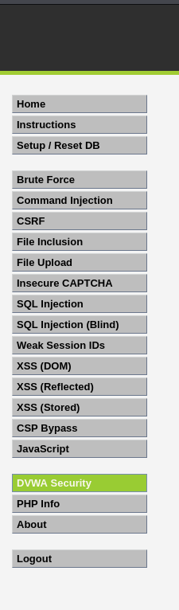

# Week 1 – OWASP ZAP Fundamentals

## Objective

The objective of this lab was to become familiar with OWASP ZAP, understand HTTP request/response communication, configure a proxy, and manually explore a vulnerable web application (DVWA).

---

# Lab Environment

| Component | Version |
|-----------|----------|
| Kali Linux | Latest |
| OWASP ZAP | 2.17 |
| DVWA | Docker |
| Browser | Firefox |
| Proxy | localhost:8080 |

---

# Skills Practiced

- Installing OWASP ZAP
- Configuring Firefox proxy
- Running DVWA in Docker
- Manual web application exploration
- HTTP Requests
- HTTP Responses
- Cookies
- Session Management
- HTTP Status Codes
- Sites Tree Navigation

---

# Pages Explored

- Home
- Instructions
- Setup
- Security
- PHP Info
- SQL Injection
- SQL Injection Blind
- Command Injection
- File Inclusion
- File Upload
- XSS Reflected
- XSS Stored
- XSS DOM
- CSRF
- Weak Session IDs
- Brute Force
- CAPTCHA

---

# HTTP Request Analysis

Example request captured in ZAP:

GET /vulnerabilities/sqli/ HTTP/1.1

Important headers observed:

- Host
- User-Agent
- Cookie
- Accept
- Referer

---

# Cookie Analysis

Captured Session Cookie:

PHPSESSID

Security Cookie:

security=low

Purpose:

- Maintains authenticated session
- Tracks logged in user
- Defines DVWA security level

---

# Key Learning Outcomes

- Learned how browsers communicate using HTTP.
- Understood the purpose of request headers.
- Learned how cookies maintain sessions.
- Configured OWASP ZAP as an interception proxy.
- Explored DVWA through the ZAP Sites tree.

---

# Screenshots

# Week 1 – OWASP ZAP Fundamentals

## Objective

Learn the OWASP ZAP interface, understand HTTP requests and responses, navigate the Sites Tree, and inspect captured web traffic using DVWA.

---

## Screenshots

### ZAP Home Screen

**Figure 1:** OWASP ZAP main interface showing the Quick Start workspace and navigation panels.

---

### Sites Tree

**Figure 2:** The Sites Tree displays all discovered pages and application resources while browsing DVWA.

---

### HTTP Request

**Figure 3:** HTTP request captured by OWASP ZAP showing the request headers sent to the DVWA SQL Injection page.

---

### HTTP Response

**Figure 4:** OWASP ZAP captured the HTTP 200 OK response from the DVWA SQL Injection page. The Response tab displays server response headers and the HTML source code returned by the web server.

---

### History Panel

**Figure 5:** The History panel records all HTTP requests intercepted while browsing DVWA. Each request includes the method, URL, status code, response time, and timestamp, allowing analysts to review and analyze web traffic.

---

### Security Level

**Figure 6:** DVWA security level configured to **Low** for learning and testing purposes.

---

### DVWA Vulnerabilities

**Figure 7:** DVWA vulnerability modules available for testing throughout the bootcamp.

## ZAP Dashboard

---

## Sites Tree

---

## HTTP Request

---

## HTTP Response

---

## History

---

## Cookie Header

---

## DVWA Security Level

---

## DVWA Pages

---

# Tools Used

- OWASP ZAP
- Firefox
- Docker
- DVWA
- Kali Linux

---

# Conclusion

This lab established the foundation for future web application penetration testing exercises. Understanding HTTP communication, cookies, session management, and proxy interception is essential before performing vulnerability assessments such as SQL Injection, XSS, CSRF, and File Inclusion.
