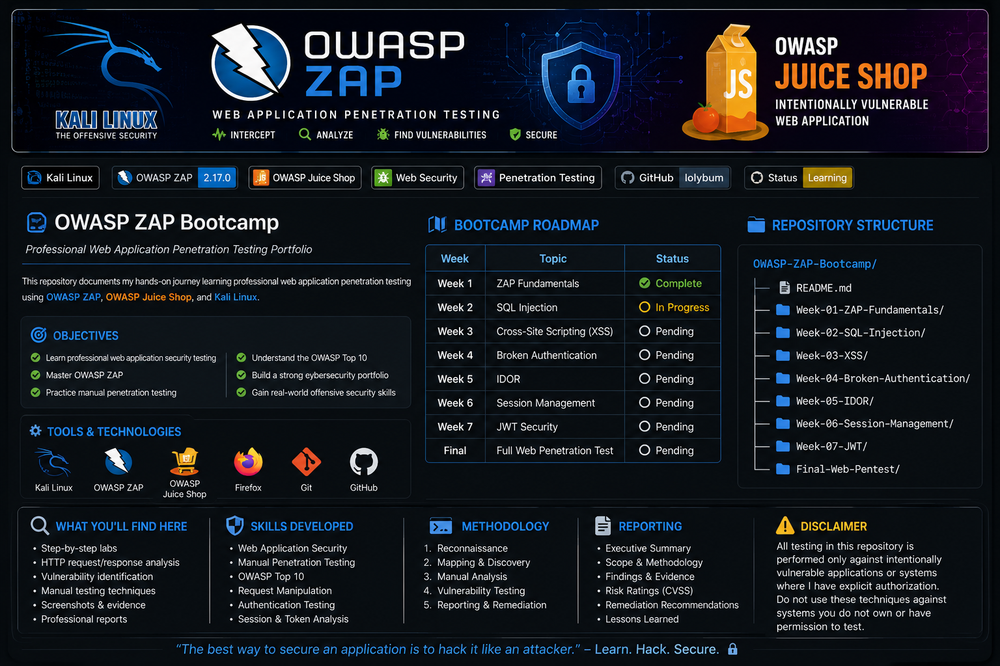

# Week 01 – OWASP ZAP Fundamentals & HTTP Traffic Analysis

<p align="center">

</p>

---

# Executive Summary

This laboratory introduces the core functionality of **OWASP Zed Attack Proxy (OWASP ZAP)** through manual exploration of the **Damn Vulnerable Web Application (DVWA)**. The objective was to understand how an intercepting proxy captures and analyzes HTTP requests and responses between a client and a web application.

During the assessment, OWASP ZAP was configured as the browser proxy to intercept live web traffic generated from DVWA. HTTP requests, responses, headers, URLs, cookies, and application resources were examined to establish a foundational understanding of web application security testing.

This exercise represents the first stage of professional web application penetration testing and serves as the foundation for subsequent vulnerability assessments.

> **This assessment was performed exclusively in an isolated laboratory environment for educational purposes. No production systems were targeted.**

---

# Lab Information

| Item | Value |
|------|-------|
| Lab | Week 01 – OWASP ZAP Fundamentals |
| Platform | DVWA |
| Tool | OWASP ZAP 2.17 |
| Browser | Mozilla Firefox |
| Operating System | Kali Linux |
| Deployment | Docker |
| Target URL | http://127.0.0.1:4280 |
| Security Level | Low |

---

# Objectives

The objectives of this laboratory were to:

- Install and configure OWASP ZAP
- Configure Firefox to use OWASP ZAP as an intercepting proxy
- Understand proxy-based web application testing
- Capture HTTP requests and responses
- Analyze HTTP headers
- Review browser-server communications
- Explore the OWASP ZAP interface
- Document web traffic using professional reporting techniques

---

# Tools Used

- OWASP ZAP 2.17
- Mozilla Firefox
- DVWA
- Docker
- Kali Linux
- GitHub

---

# OWASP ZAP Overview

OWASP ZAP (Zed Attack Proxy) is an open-source web application security testing tool maintained by the Open Worldwide Application Security Project (OWASP).

Primary capabilities include:

- Intercepting Proxy
- Passive Scanning
- Active Scanning
- Request Replay
- Spidering
- Fuzzing
- Authentication Testing
- Session Analysis
- Manual Penetration Testing

---

# Lab Methodology

The assessment followed the methodology below:

1. Deploy DVWA using Docker.
2. Launch OWASP ZAP.
3. Configure Firefox to use localhost:8080 as its proxy.
4. Browse the target application.
5. Capture HTTP requests.
6. Inspect HTTP responses.
7. Review application resources.
8. Analyze HTTP headers.
9. Document findings.

---

# Screenshots

## OWASP ZAP Home Screen


**Figure 1:** OWASP ZAP interface after launching the application.

---

## Sites Tree


**Figure 2:** ZAP automatically discovers the application's directory structure while browsing DVWA.

---

## HTTP Request


**Figure 3:** HTTP request captured by OWASP ZAP showing browser communication with the target application.

---

## HTTP Response


**Figure 4:** HTTP response returned by the server containing status code, headers, and HTML content.

---

## History Panel


**Figure 5:** History panel displaying captured HTTP requests exchanged during testing.

---

# Findings

## Finding 1

### Successful Proxy Configuration

**Severity:** Informational

**Observation**

Mozilla Firefox successfully routed traffic through OWASP ZAP, allowing complete visibility into HTTP communications between the client and the web application.

---

## Finding 2

### HTTP Request Analysis

**Severity:** Informational

**Observation**

Captured requests contained:

- HTTP Method
- URL
- Host Header
- Cookies
- User-Agent
- Referer
- Query Parameters

These components provide valuable insight into how browsers communicate with web applications.

---

## Finding 3

### HTTP Response Analysis

**Severity:** Informational

**Observation**

The server returned standard HTTP responses including:

```
HTTP/1.1 200 OK
```

The responses contained:

- Status Code
- Response Headers
- HTML Content
- Content-Type
- Cookies
- Cache-Control Directives

---

## Finding 4

### Site Mapping

**Severity:** Informational

**Observation**

OWASP ZAP successfully mapped the application's directory structure through passive browsing, enabling analysts to identify accessible resources for further testing.

---

## Finding 5

### Passive Security Analysis

**Severity:** Informational

**Observation**

Passive inspection identified several application components that will become targets for subsequent assessments, including:

- SQL Injection
- Cross-Site Scripting (XSS)
- Authentication
- Session Management
- File Upload
- CSRF

---

# Risk Assessment

| Category | Risk |
|----------|------|
| Proxy Misconfiguration | Low |
| HTTP Traffic Exposure | Informational |
| Passive Enumeration | Informational |

Overall Risk Rating:

# 🟢 INFORMATIONAL

No exploitation was performed during this laboratory.

---

# Skills Demonstrated

- Web Application Security
- Proxy Configuration
- HTTP Protocol Analysis
- OWASP ZAP Navigation
- Manual Web Testing
- Traffic Inspection
- HTTP Header Analysis
- Browser Proxy Configuration
- Technical Documentation
- GitHub Portfolio Development

---

# Learning Outcomes

This exercise strengthened practical experience in:

- Configuring interception proxies
- Understanding browser-server communications
- Reading HTTP requests
- Reading HTTP responses
- Understanding web application architecture
- Using OWASP ZAP professionally
- Documenting penetration testing activities

---

# Next Steps

The knowledge gained during this lab serves as the foundation for advanced web application security testing, including:

- SQL Injection
- Cross-Site Scripting (XSS)
- Broken Authentication
- Insecure Direct Object References (IDOR)
- Session Management Testing
- JSON Web Token (JWT) Analysis

---

# References

OWASP ZAP

https://www.zaproxy.org/

OWASP Web Security Testing Guide

https://owasp.org/www-project-web-security-testing-guide/

OWASP Top 10

https://owasp.org/www-project-top-ten/

DVWA

https://github.com/digininja/DVWA

MITRE ATT&CK

https://attack.mitre.org/

---

# Disclaimer

This laboratory was conducted within an isolated penetration testing environment using the Damn Vulnerable Web Application (DVWA). All testing activities were performed solely for educational purposes. No production systems, third-party infrastructure, or unauthorized targets were assessed.
