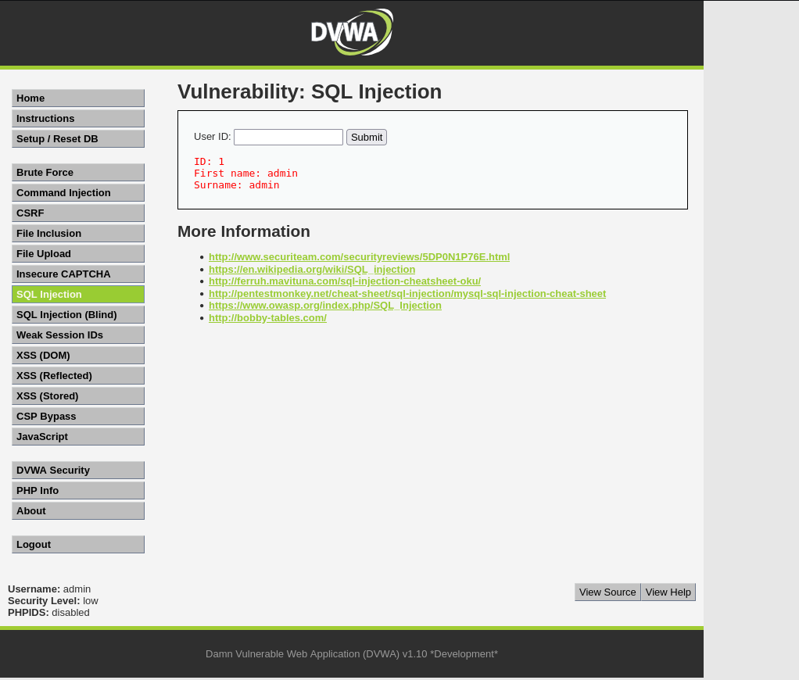
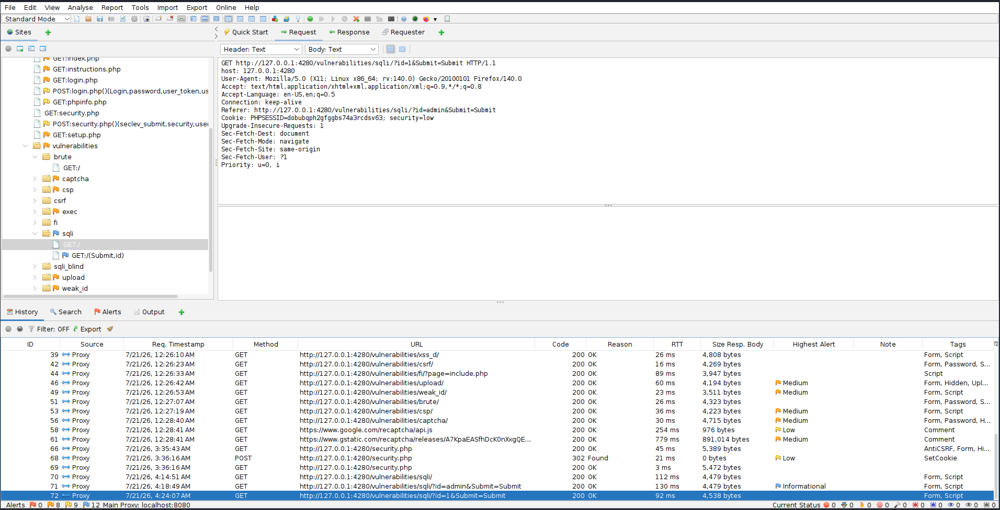
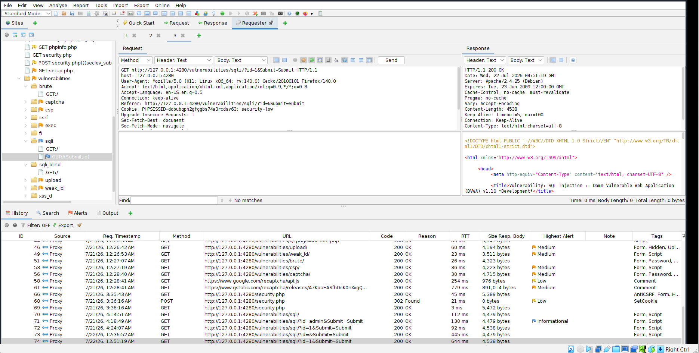

# Week 02 – SQL Injection Testing with OWASP ZAP & DVWA


## Executive Summary

This laboratory demonstrates the identification and analysis of a SQL Injection (SQLi) vulnerability using **OWASP ZAP** against the **Damn Vulnerable Web Application (DVWA)** in a controlled environment.

The objective of this exercise was to understand how SQL Injection vulnerabilities are introduced through unsanitized user input and how HTTP requests and responses can be analyzed using OWASP ZAP. During testing, normal user input was submitted, intercepted, replayed using the ZAP Requester tool, and examined to understand how web applications process database queries.

This project was conducted for educational purposes within an isolated lab environment and does not target production systems.

---

# Lab Objective

The objectives of this lab were to:

- Understand the fundamentals of SQL Injection.
- Configure OWASP ZAP as an intercepting proxy.
- Capture HTTP requests and responses generated by DVWA.
- Analyze GET parameters used in SQL queries.
- Replay intercepted requests using the ZAP Requester tool.
- Document findings using industry-standard penetration testing methodology.
- Build practical experience in web application security testing.

---

# Lab Environment

| Component | Details |
|-----------|---------|
| Target Application | Damn Vulnerable Web Application (DVWA) |
| Web Server | Apache 2.4 |
| Database | MySQL |
| Operating System | Kali Linux |
| Browser | Mozilla Firefox |
| Proxy | OWASP ZAP 2.17 |
| Security Level | Low |
| Target URL | http://127.0.0.1:4280 |

---

# Tools Used

- OWASP ZAP 2.17
- Mozilla Firefox
- DVWA
- Docker
- Kali Linux
- GitHub

---

# Vulnerability Overview

## What is SQL Injection?

SQL Injection is a web application vulnerability that occurs when user-supplied input is incorporated directly into SQL queries without proper validation or parameterization.

Successful exploitation may allow an attacker to:

- Read sensitive information
- Bypass authentication
- Modify database records
- Delete application data
- Execute administrative database commands

OWASP classifies SQL Injection as one of the most critical web application security risks.

Reference:

https://owasp.org/www-community/attacks/SQL_Injection

---

# Testing Methodology

The following methodology was used throughout the assessment.

## Step 1 – Configure OWASP ZAP

- Configure Firefox to use ZAP as the HTTP proxy.
- Verify all traffic passes through ZAP.

---

## Step 2 – Access DVWA

- Login using the default administrator account.
- Set DVWA Security Level to **Low**.

---

## Step 3 – Navigate to SQL Injection

Open:

```
SQL Injection
```

---

## Step 4 – Execute a Normal Query

Input:

```
1
```

Expected Result:

```
ID: 1
First Name: admin
Surname: admin
```

---

## Step 5 – Capture HTTP Request

Intercept the request generated by DVWA.

Example:

```
GET /vulnerabilities/sqli/?id=1&Submit=Submit HTTP/1.1
```

Observe:

- HTTP Method
- URL
- Query Parameters
- Cookies
- Request Headers

---

## Step 6 – Analyze HTTP Response

Inspect the response returned by the web server.

Observe:

- HTTP Status Code
- Response Headers
- HTML Body
- Returned User Information

---

## Step 7 – Replay Request

Open the captured request using:

```
Requester
```

Replay the request.

Observe:

- Identical server response
- Request replay functionality
- Manual testing workflow

---

# Findings

## Finding 1

### Normal SQL Query

Severity:

**Medium**

Description:

The application accepts user-supplied input through the **id** parameter and retrieves database records without visible input validation.

Evidence:

User ID:

```
1
```

Returned:

```
First name: admin
Surname: admin
```

---

## Finding 2

### HTTP Request Captured

Severity:

Informational

Observation:

OWASP ZAP successfully intercepted the HTTP GET request before it reached the application.

Captured Information:

- Request URL
- Cookies
- Browser Headers
- GET Parameters

---

## Finding 3

### HTTP Response Analysis

Severity:

Informational

Observation:

The web server returned:

```
HTTP/1.1 200 OK
```

The response contained user information generated from the SQL query.

---

## Finding 4

### Request Replay

Severity:

Informational

Observation:

The Requester tool successfully resent the captured request and reproduced the server response.

This confirms the request can be manually modified and replayed during security assessments.

---

# Screenshot Gallery

## 1. SQL Injection Landing Page


**Figure 1:** DVWA SQL Injection page before user input.

---

## 2. Normal Query



**Figure 2:** Successful lookup using User ID 1.

---

## 3. OWASP ZAP Request



**Figure 3:** Captured HTTP GET request generated by DVWA.

---

## 4. OWASP ZAP Response


**Figure 4:** HTTP response returned from the web server.

---

## 5. Request Replay



**Figure 5:** Request replay using OWASP ZAP Requester.

---

# Risk Assessment

| Risk | Rating |
|-------|---------|
| Confidentiality | High |
| Integrity | High |
| Availability | Medium |
| Overall Risk | High |

---

# Remediation Recommendations

To mitigate SQL Injection vulnerabilities:

- Use parameterized SQL queries (Prepared Statements).
- Validate all user input.
- Implement server-side input sanitization.
- Use stored procedures where appropriate.
- Apply the principle of least privilege to database accounts.
- Disable verbose database error messages.
- Perform regular web application security testing.
- Implement a Web Application Firewall (WAF).

---

# MITRE ATT&CK Mapping

| Technique | ID |
|-----------|----|
| Exploit Public-Facing Application | T1190 |
| Valid Accounts (Post Exploitation) | T1078 |
| Data from Information Repositories | T1213 |

Reference:

https://attack.mitre.org/

---

# Skills Demonstrated

- Web Application Security Testing
- OWASP ZAP
- SQL Injection Analysis
- HTTP Request Inspection
- HTTP Response Analysis
- Proxy Configuration
- Request Replay
- Web Vulnerability Documentation
- GitHub Documentation
- Technical Reporting

---

# Key Takeaways

This lab demonstrated how SQL Injection vulnerabilities can be identified by observing HTTP traffic rather than immediately attempting exploitation. Understanding request structure, response behavior, and replay techniques provides a strong foundation for manual web application security assessments.

---

# References

- OWASP SQL Injection

https://owasp.org/www-community/attacks/SQL_Injection

- OWASP ZAP

https://www.zaproxy.org/

- DVWA

https://github.com/digininja/DVWA

- MITRE ATT&CK

https://attack.mitre.org/

---

# Disclaimer

This project was performed within an isolated laboratory environment using intentionally vulnerable software for educational purposes only. No unauthorized systems were targeted.
