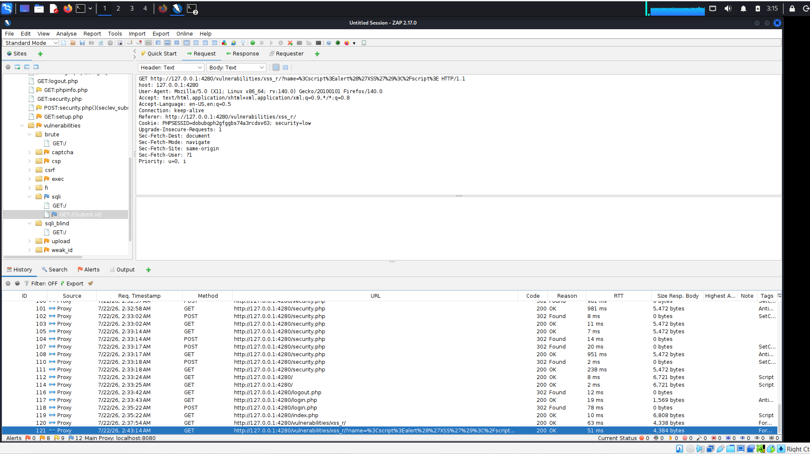
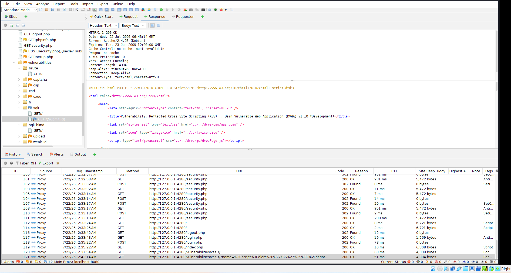
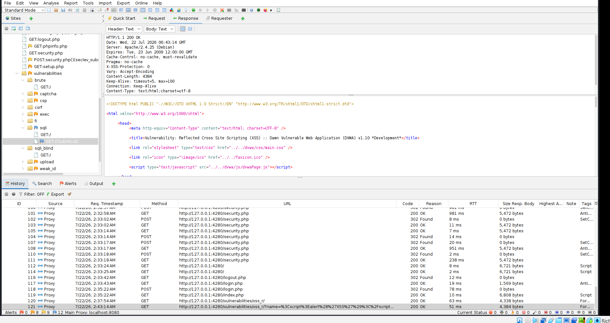
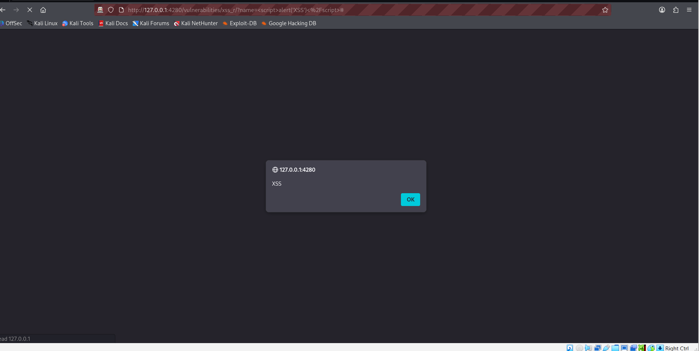

# Week 03 – Cross-Site Scripting (XSS) Testing with OWASP ZAP & DVWA


---

## Executive Summary

This laboratory demonstrates the identification and analysis of a **Reflected Cross-Site Scripting (XSS)** vulnerability using **OWASP ZAP** against the **Damn Vulnerable Web Application (DVWA)** in a controlled environment.

The objective was to understand how reflected XSS vulnerabilities occur when user-supplied input is returned to the browser without proper validation or output encoding. HTTP requests and responses were intercepted, analyzed, and documented using OWASP ZAP to illustrate the complete attack workflow.

---

## Lab Information

| Item | Value |
|------|-------|
| Project | Week 03 – Cross-Site Scripting (XSS) |
| Vulnerability | Reflected Cross-Site Scripting (XSS) |
| Platform | Damn Vulnerable Web Application (DVWA) |
| Operating System | Kali Linux |
| Proxy | OWASP ZAP 2.17 |
| Browser | Mozilla Firefox |
| Target URL | http://127.0.0.1:4280 |

---

# Tools Used

- OWASP ZAP 2.17
- Mozilla Firefox
- DVWA
- Docker
- Kali Linux
- GitHub

---

# Vulnerability Overview

## What is Cross-Site Scripting (XSS)?

Cross-Site Scripting (XSS) is a client-side web application vulnerability that occurs when an application includes untrusted user input in a web page without proper validation or output encoding.

An attacker may exploit XSS to:

- Execute malicious JavaScript
- Steal session cookies
- Hijack authenticated sessions
- Redirect users to malicious websites
- Deface web pages
- Capture sensitive information

---

# Lab Objectives

This lab was conducted to:

- Understand Reflected Cross-Site Scripting
- Configure Firefox to use OWASP ZAP
- Capture HTTP requests and responses
- Analyze reflected user input
- Verify successful JavaScript execution
- Document findings using professional penetration testing methodology

---

# Lab Environment

| Component | Configuration |
|------------|---------------|
| Host OS | Windows 11 |
| Guest OS | Kali Linux |
| Target Application | DVWA |
| Proxy | OWASP ZAP |
| Browser | Firefox |
| Security Level | Low |

---

# Testing Methodology

1. Launch DVWA.
2. Set DVWA Security Level to **Low**.
3. Configure Firefox to use OWASP ZAP as the HTTP proxy.
4. Navigate to the Reflected XSS page.
5. Submit normal input.
6. Submit a JavaScript payload.
7. Capture HTTP requests.
8. Capture HTTP responses.
9. Verify JavaScript execution.
10. Document findings.

---

# Findings

## Finding 1 – Normal User Input

**Severity:** Informational

### Observation

A normal value was entered into the vulnerable input field.

Example:

```
Stephen
```

The application reflected the value back to the browser without causing script execution.

### Evidence


**Figure 1:** Normal user input submitted to establish baseline application behavior.

---

## Finding 2 – Reflected XSS Payload

**Severity:** High

### Payload

```html
<script>alert('XSS')</script>
```

### Observation

The application reflected the payload back to the browser without sanitizing or encoding the input.

### Evidence


**Figure 2:** JavaScript payload submitted through the vulnerable input field.

---

## Finding 3 – HTTP Request Analysis

**Severity:** Informational

### Observation

OWASP ZAP intercepted the HTTP GET request containing the malicious payload.

Example:

```
GET /vulnerabilities/xss_r/?name=<script>alert('XSS')</script>
```

### Evidence



**Figure 3:** HTTP request intercepted by OWASP ZAP containing the reflected XSS payload.

---

## Finding 4 – HTTP Response Analysis

**Severity:** Informational

### Observation

The server returned:

```http
HTTP/1.1 200 OK
```

The HTML response contained the reflected user input without proper output encoding.

### Evidence



**Figure 4:** HTTP response returned by DVWA showing successful processing of the malicious payload.

---

## Finding 5 – History Panel

**Severity:** Informational

### Observation

The OWASP ZAP History panel recorded all intercepted requests and responses generated during testing.

### Evidence



**Figure 5:** ZAP History panel displaying captured traffic associated with the reflected XSS attack.

---

## Finding 6 – Successful JavaScript Execution

**Severity:** High

### Observation

The browser executed the injected JavaScript payload.

The following alert dialog appeared:

```
XSS
```

This confirms that the payload executed successfully within the victim's browser.

### Evidence



**Figure 6:** Browser alert confirming successful execution of the injected JavaScript payload.

---

# Risk Assessment

| Category | Rating |
|-----------|--------|
| Likelihood | High |
| Impact | High |
| Overall Risk | High |

---

# MITRE ATT&CK Mapping

| Technique | ID |
|------------|----|
| Drive-by Compromise | T1189 |
| Command and Scripting Interpreter | T1059 |
| Input Capture | T1056 |

---

# OWASP Top 10 Mapping

| Category | Description |
|-----------|-------------|
| A03:2021 | Injection |
| A07:2021 | Identification and Authentication Failures (session theft risk) |

---

# Remediation Recommendations

- Validate all user input.
- Apply context-aware output encoding.
- Implement Content Security Policy (CSP).
- Sanitize HTML before rendering.
- Use secure development frameworks.
- Enable HTTPOnly cookies.
- Enable Secure cookies.
- Conduct regular penetration testing.
- Perform secure code reviews.
- Implement Web Application Firewall (WAF) protections.

---

# Skills Demonstrated

- Web Application Security Testing
- OWASP ZAP
- HTTP Request Analysis
- HTTP Response Analysis
- Reflected XSS Testing
- Proxy Configuration
- Penetration Testing Documentation
- GitHub Portfolio Development

---

# Conclusion

This laboratory successfully demonstrated a Reflected Cross-Site Scripting (XSS) vulnerability within DVWA. By capturing and analyzing HTTP requests and responses with OWASP ZAP, the vulnerability lifecycle—from payload submission to JavaScript execution—was documented in a controlled environment. The exercise reinforces the importance of secure input handling, output encoding, and layered defensive controls in modern web applications.

---

# References

**OWASP Cross-Site Scripting**

https://owasp.org/www-community/attacks/xss/

**OWASP ZAP**

https://www.zaproxy.org/

**DVWA**

https://github.com/digininja/DVWA

**MITRE ATT&CK**

https://attack.mitre.org/

---

# Disclaimer

This laboratory was performed in a controlled environment using the Damn Vulnerable Web Application (DVWA) for educational and defensive security purposes only. All testing was conducted on systems owned by or intentionally made available to the tester. The techniques demonstrated should never be used against systems without explicit authorization.
