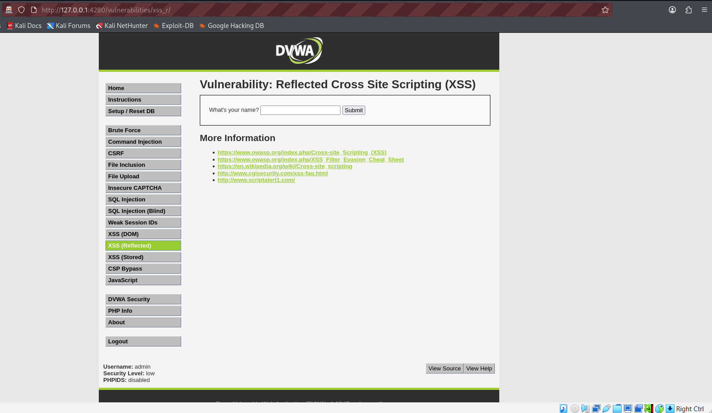
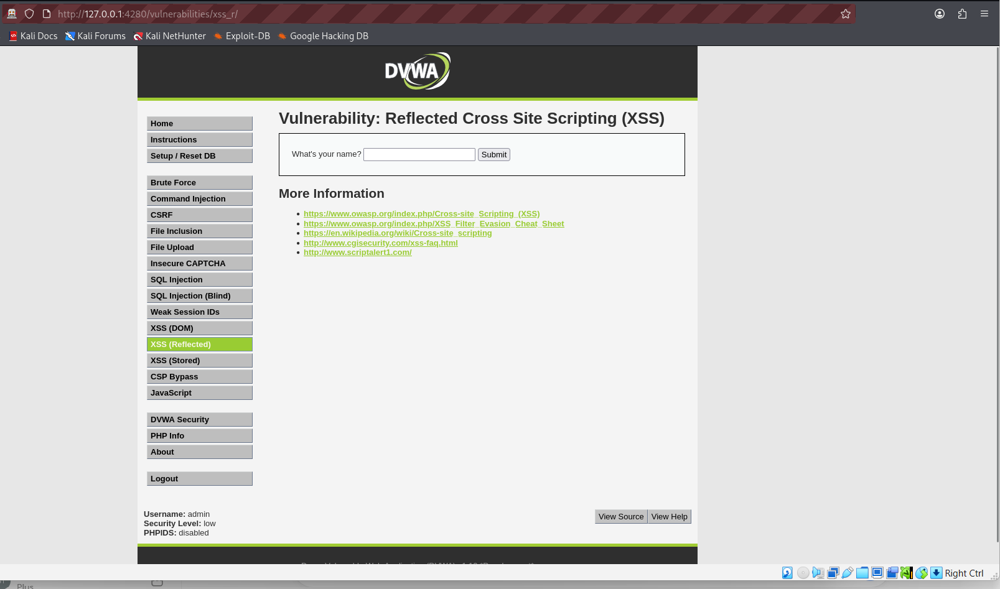

# Week 03 – Cross-Site Scripting (XSS) Testing with OWASP ZAP & DVWA


---

# Executive Summary

This laboratory demonstrates the identification and analysis of a **Reflected Cross-Site Scripting (XSS)** vulnerability using **OWASP ZAP** against the **Damn Vulnerable Web Application (DVWA)** in a controlled environment.

The purpose of this lab was to understand how reflected XSS vulnerabilities occur when user-supplied input is returned to the browser without proper validation or output encoding. HTTP requests and responses were captured using OWASP ZAP, and the Requester tool was used to replay requests for further analysis.

This assessment was performed exclusively within an isolated laboratory environment using intentionally vulnerable software for educational purposes.

---

# Lab Objectives

The objectives of this laboratory were to:

- Understand the fundamentals of Cross-Site Scripting (XSS)
- Configure OWASP ZAP as an intercepting proxy
- Capture HTTP requests generated by DVWA
- Analyze server responses
- Understand reflected user input
- Replay captured requests using the OWASP ZAP Requester
- Practice manual web application security testing
- Document findings using professional penetration testing methodology

---

# Lab Environment

| Component | Details |
|----------|----------|
| Target Application | Damn Vulnerable Web Application (DVWA) |
| Vulnerability | Reflected Cross-Site Scripting (XSS) |
| Web Server | Apache 2.4 |
| Operating System | Kali Linux |
| Browser | Mozilla Firefox |
| Proxy | OWASP ZAP 2.17 |
| Security Level | Low |
| Target URL | http://127.0.0.1:4280 |

---

# Tools Used

- OWASP ZAP 2.17
- Mozilla Firefox
- DVWA
- Docker
- Kali Linux
- GitHub

---

# Vulnerability Overview

## What is Cross-Site Scripting (XSS)?

Cross-Site Scripting (XSS) is a client-side web application vulnerability that occurs when an application includes untrusted user input in a web page without proper validation or output encoding.

An attacker may exploit XSS to:

- Execute malicious JavaScript
- Steal session cookies
- Hijack user sessions
- Redirect users to malicious websites
- Deface web pages
- Capture sensitive information

Reflected XSS occurs when user input is immediately reflected back to the browser.

Reference:

https://owasp.org/www-community/attacks/xss/

---

# Testing Methodology

## Step 1 – Configure OWASP ZAP

Configure Firefox to use OWASP ZAP as its HTTP proxy.

Verify all browser traffic passes through ZAP.

---

## Step 2 – Login to DVWA

Login using:

Username:

```
admin
```

Password:

```
password
```

---

## Step 3 – Set Security Level

Navigate to:

```
DVWA Security
```

Set:

```
Low
```

---

## Step 4 – Open Reflected XSS

Navigate to:

```
XSS (Reflected)
```

---

## Step 5 – Submit Normal Input

Input:

```
Stephen
```

Submit the form.

Expected Output:

```
Hello Stephen
```

---

## Step 6 – Capture HTTP Request

Using OWASP ZAP:

Capture the GET request generated by DVWA.

Observe:

- URL
- Query Parameter
- Cookies
- Request Headers
- Browser Headers

---

## Step 7 – Analyze HTTP Response

Inspect:

- HTTP Status
- Response Headers
- HTML Body
- Reflected User Input

---

## Step 8 – Replay Request

Open the request using:

```
Requester
```

Replay the request.

Verify that the response matches the original request.

---

# Findings

## Finding 1

### Reflected User Input

Severity:

Medium

Description:

The application reflects user input directly within the HTML response.

This behavior demonstrates how reflected XSS vulnerabilities occur when output encoding is not implemented.

---

## Finding 2

### HTTP Request Captured

Severity:

Informational

Observation:

OWASP ZAP successfully intercepted the browser request.

Captured:

- GET request
- Request headers
- Query string
- Cookies

---

## Finding 3

### HTTP Response Analysis

Severity:

Informational

Observation:

The server returned:

```
HTTP/1.1 200 OK
```

The response included the reflected user input.

---

## Finding 4

### Request Replay

Severity:

Informational

Observation:

The Requester tool successfully replayed the captured HTTP request.

The server returned an identical response.

---

# Screenshot Gallery

## 1. XSS Landing Page



**Figure 1:** DVWA Reflected XSS module before submitting user input.

---

## 2. Normal User Input



**Figure 2:** Application response after submitting a normal name.

---

## 3. OWASP ZAP Request


**Figure 3:** Captured HTTP GET request generated by DVWA.

---

## 4. OWASP ZAP Response


**Figure 4:** HTTP response containing the reflected user input.

---

## 5. Request Replay


**Figure 5:** Request replay using OWASP ZAP Requester.

---

# Risk Assessment

| Risk | Rating |
|------|---------|
| Confidentiality | High |
| Integrity | Medium |
| Availability | Low |
| Overall Risk | Medium |

---

# Remediation Recommendations

To reduce the risk of Cross-Site Scripting vulnerabilities:

- Validate all user input
- Encode output before rendering HTML
- Implement Content Security Policy (CSP)
- Sanitize user-generated content
- Use secure development frameworks
- Enable HttpOnly cookies
- Use Secure cookies
- Conduct regular web application security assessments

---

# MITRE ATT&CK Mapping

| Technique | ID |
|-----------|----|
| Exploit Public-Facing Application | T1190 |
| Input Capture | T1056 |
| Browser Session Hijacking | T1185 |

Reference:

https://attack.mitre.org/

---

# Skills Demonstrated

- OWASP ZAP
- Manual Web Application Testing
- Cross-Site Scripting Analysis
- HTTP Request Analysis
- HTTP Response Analysis
- Request Replay
- Web Proxy Configuration
- Browser Security Testing
- Vulnerability Documentation
- GitHub Project Documentation

---

# Key Takeaways

This laboratory demonstrated how reflected user input can introduce Cross-Site Scripting vulnerabilities when output encoding is not properly implemented. By analyzing intercepted HTTP traffic and replaying requests using OWASP ZAP, a security analyst gains valuable insight into how web applications process and render user-supplied data.

---

# References

OWASP Cross-Site Scripting

https://owasp.org/www-community/attacks/xss/

OWASP ZAP

https://www.zaproxy.org/

DVWA

https://github.com/digininja/DVWA

MITRE ATT&CK

https://attack.mitre.org/

---

# Disclaimer

This laboratory was conducted within a controlled environment using the Damn Vulnerable Web Application (DVWA) for educational and training purposes only. All testing was performed on intentionally vulnerable software owned and operated by the tester. No unauthorized systems or production environments were targeted.
